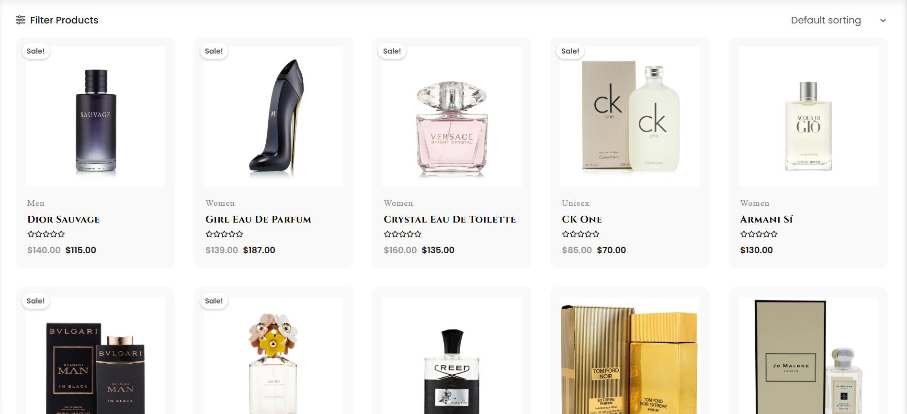
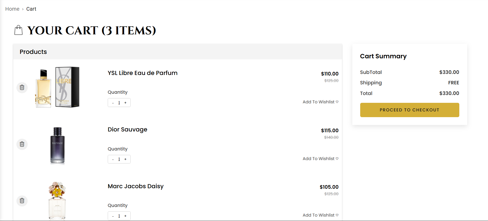

# 🌸 Scentora, Perfume E-Commerce Web App

**Scentora** is a modern perfume e-commerce web application built with **React**.  
It features a smooth and responsive user interface, dynamic product filtering, cart management with a sidebar preview, and secure payment integration through **Paystack** (test mode).

🔗 **Live Demo:** [https://scentora-ecommerce.netlify.app/](https://scentora-ecommerce.netlify.app/)

---

## 🖼️ Screenshots

| Home Page | Shop Page | Cart Page |
|------------|------------|-----------|
|  |  |  |

---

## 💎 Key Features

- 🛍️ Perfume catalog with category filtering and detailed product views  
- ➕ Add-to-cart functionality with real-time updates  
- 🧺 Cart sidebar and full cart page  
- 💾 Persistent cart items using **localStorage**  
- 💳 Checkout and **Paystack** payment integration (test mode)  
- 📱 Fully responsive design for all screen sizes  

---

## 🚀 Tech Stack

- **Frontend:** React, React Router, Context API  
- **UI Library:** Material UI (MUI)  
- **Payment Gateway:** Paystack API (Test Mode)  
- **Styling:** Custom CSS  

---

## 🧠 What I Learned

- React Router  
  - useLocation  
  - useParams  
  - useNavigate  
- React Router Navigate with State  
- MUI  
- Filter & Sorting Logic  
- React Context  
- Persistence using LocalStorage  
- Lifting State  
- Form Validation  
- Paystack Integration (Test Mode)

---

## 🧩 Future Improvements

- 🔐 Add authentication for user accounts  
- 📦 Implement a backend for managing products dynamically  
- 🧾 Include order history and payment receipts  
- ✨ Add animations and improved user feedback messages  

---

## 📜 License

This project is open-source and available under the [MIT License](LICENSE).
